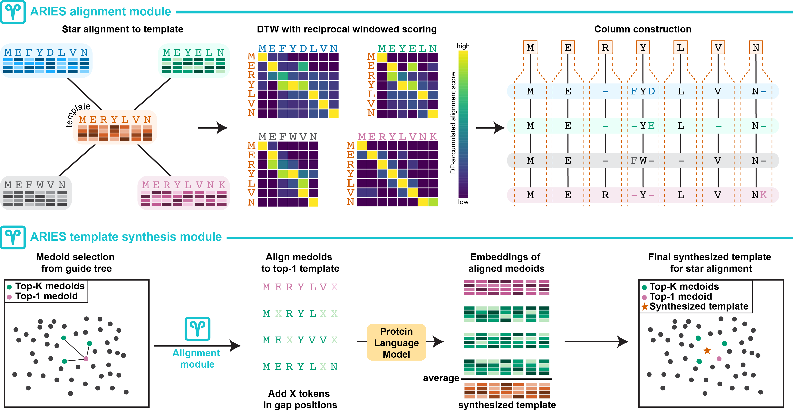

#  **ARIES**
Fast, accurate construction of multiple sequence alignments from protein language embeddings

  

Multiple sequence alignment (MSA) is a foundational task in computational biology, underpinning protein structure prediction, evolutionary analysis, and domain annotation. Traditional MSA algorithms rely on pairwise amino acid substitution matrices derived from conserved protein families. While effective for aligning closely related sequences, these scoring schemes struggle in the low identity ``twilight zone.'' Here, we present a new approach for constructing MSAs leveraging amino acid embeddings generated by protein language models (PLMs), which capture rich evolutionary and contextual information from massive and diverse sequence datasets. We introduce a windowed reciprocal-weighted embedding similarity metric that is surprisingly effective in identifying corresponding amino acids across sequences. Building on this metric, we develop ARIES (**A**lignment via **R**ec**I**procal **E**mbedding **S**imilarity), an algorithm that constructs a PLM-generated template embedding and aligns each sequence to this template via dynamic time warping in order to build a global MSA. Across diverse benchmark datasets, ARIES achieves significantly higher accuracy than existing state-of-the-art approaches, especially in low-identity regimes where traditional methods degrade, while scaling almost linearly with the number of sequences to be aligned. Together, these results provide the first large-scale demonstration of the power of PLMs for accurate and scalable MSA construction across protein families of varying sizes and levels of similarity, highlighting the potential of PLMs to transform comparative sequence analysis.