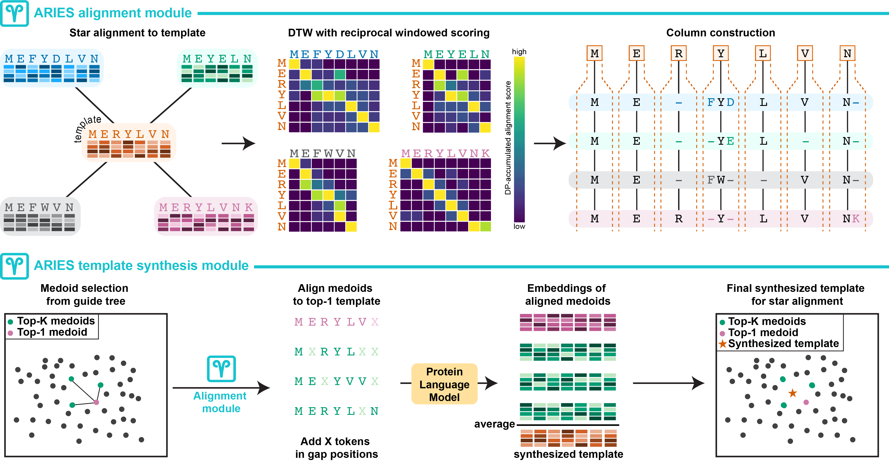

<div align="center">

  <h1 style="margin: 0; padding: 0;">
    
    ARIES
  </h1>

</div>

Fast, accurate construction of multiple sequence alignments from protein language embeddings

<p align="center">
  
</p>

Multiple sequence alignment (MSA) is a foundational task in computational biology, underpinning protein structure prediction, evolutionary analysis, and domain annotation. Traditional MSA algorithms rely on pairwise amino acid substitution matrices derived from conserved protein families. While effective for aligning closely related sequences, these scoring schemes struggle in the low identity ''twilight zone.'' 

Here, we present a new approach for constructing MSAs leveraging amino acid embeddings generated by protein language models (PLMs), which capture rich evolutionary and contextual information from massive and diverse sequence datasets. We introduce a windowed reciprocal-weighted embedding similarity metric that is surprisingly effective in identifying corresponding amino acids across sequences. 

Building on this metric, we develop ARIES (**A**lignment via **R**ec**I**procal **E**mbedding **S**imilarity), an algorithm that constructs a PLM-generated template embedding and aligns each sequence to this template via dynamic time warping in order to build a global MSA. Across diverse benchmark datasets, ARIES achieves significantly higher accuracy than existing state-of-the-art approaches, especially in low-identity regimes where traditional methods degrade, while scaling almost linearly with the number of sequences to be aligned. 

Together, these results provide the first large-scale demonstration of the power of PLMs for accurate and scalable MSA construction across protein families of varying sizes and levels of similarity, highlighting the potential of PLMs to transform comparative sequence analysis.


---

## Quickstart

### 1) Clone
```
git clone https://github.com/Singh-Lab/ARIES.git
cd ARIES
```

### 2) Create the conda environment

**Linux:**
```
conda env create -f environment.yml
conda activate ARIES
```

**macOS:**
```
conda env create -f environment-osx-arm64.yml
conda activate ARIES
```
The Linux `environment.yml` pins CUDA-specific builds and will not solve on macOS; use the `osx-arm64` file instead. It installs the CPU/MPS build of PyTorch.

### 3) Install the ARIES package
```
pip install .
```

### 4) Run ARIES from command line

`--input` is a **path to a folder** containing one FASTA file per alignment: each `.fasta`
holds the unaligned sequences of a single protein family and is aligned independently.
ARIES writes one aligned FASTA per input file to `--output-dir`, named by the input's
filename stem. Because `--input` is a path, ARIES can be run from any directory.

#### Bundled benchmark datasets
The `BAliBASE`, `HOMSTRAD`, and `QuanTest2` benchmarks download with the repository under
`datasets/`. Point `--input` at
their `inputs` folder:
```
aries --input ./datasets/BAliBASE/inputs --output-dir ./outputs/BAliBASE
aries --input ./datasets/HOMSTRAD/inputs --output-dir ./outputs/HOMSTRAD
aries --input ./datasets/QuanTest2/inputs --output-dir ./outputs/QuanTest2
```
SP/TC scores are generated automatically for these, because each dataset folder pairs an
`inputs` directory with an accompanying `reference_outputs` directory (see auto-scoring below).

#### Custom input folder (optional reference alignment directory for SP/TC scoring)
```
aries --input /path/to/fastas --output-dir /path/to/outputs
aries --input /path/to/fastas --ref-dir /path/to/refs --output-dir /path/to/outputs
```

Notes:
- Input files must be FASTA (`.fasta`).
- Reference files must be FASTA (`.aln`, `.fasta`, or `.fa`).
- Each reference file is matched to its input by filename stem (e.g. `PF001.fasta` ↔ `PF001.aln`); unmatched inputs are still aligned, just not scored.
- **Auto-scoring**: if `--ref-dir` is omitted and the input folder is named `inputs` with an accompanying `reference_outputs/` directory, references are detected automatically and scoring is enabled. Otherwise pass `--ref-dir` explicitly.
- Required arguments: `--input` (or `-i`) and `--output-dir` (or `-o`).
- ARIES writes temporary scratch files (guide trees, intermediate alignments) to a `./tmp` directory in the current working directory.
- Run `aries -h` to see all options and defaults.

#### Device selection
By default `--device auto` selects the best available backend: CUDA on Linux (NVIDIA), Metal (MPS) on Apple Silicon, otherwise CPU. You can also request a backend explicitly:
```
aries --input ./datasets/HOMSTRAD/inputs --output-dir ./outputs/HOMSTRAD --device cuda   # Linux GPU
aries --input ./datasets/HOMSTRAD/inputs --output-dir ./outputs/HOMSTRAD --device mps    # Apple Silicon
aries --input ./datasets/HOMSTRAD/inputs --output-dir ./outputs/HOMSTRAD --device cpu    # any platform
```
If a requested backend is unavailable, ARIES prints a warning and falls back to CPU. On macOS, if a PLM operation lacks a Metal kernel, set `PYTORCH_ENABLE_MPS_FALLBACK=1` to let those ops run on CPU.

## CLI Reference

```
usage: aries -i INPUT -o OUTPUT_DIR [--ref-dir REF_DIR]
                    [--compare {clustalo,clustalw}]
                    [--plm PLM] [--num-hidden-states NUM_HIDDEN_STATES]
                    [-w WINDOW] [-r RECIPROCAL] [--batch BATCH]
                    [--blur BLUR] [--pad-char PAD_CHAR]
                    [--medoid-topk MEDOID_TOPK]
                    [--maxlen MAXLEN] [--device DEVICE] [--seed SEED]

--input, -i            Path to a folder of input FASTA (.fasta) files (e.g. ./datasets/HOMSTRAD/inputs).
--output-dir, -o       Directory to write ARIES alignments (FASTA). Created if missing.
--ref-dir              Optional reference alignment directory (enables scoring).
--compare              Run comparison aligners in addition to ARIES: clustalo and/or clustalw.

--plm                  PLM name (esm2-35M, esm2-150M, esm2-650M, protbert, prottrans,
                       prottrans-half, or a Hugging Face model name). Default: esm2-650M
--num-hidden-states    Number of hidden states to concat. Default: 9
--window, -w           Context window size for similarity. Default: 5
--reciprocal, -r       Reciprocal weighting for similarity. Default: 200.0
--batch                PLM batch size. Default: 32
--blur                 Gaussian blur sigma for similarity. Default: 3.0
--pad-char             Padding character (default: X). Pass '!' to use the tokenizer's
                       native pad token.
--medoid-topk          Medoid top-k selection for template synthesis: 'log' (ceil(log2(n))), 
                       'ln' (ceil(ln(n))), or a positive integer k. Default: ln
--maxlen               Max sequence length to include from dataset. If set above 1022, 
                       residues will be processed via PLM tiling. Default: 1022
--device               Device for PLM/ARIES: 'auto' (cuda > mps > cpu), or an explicit
                       'cuda', 'mps', or 'cpu'. Default: auto
--seed                 Random seed. Default: 123
```
